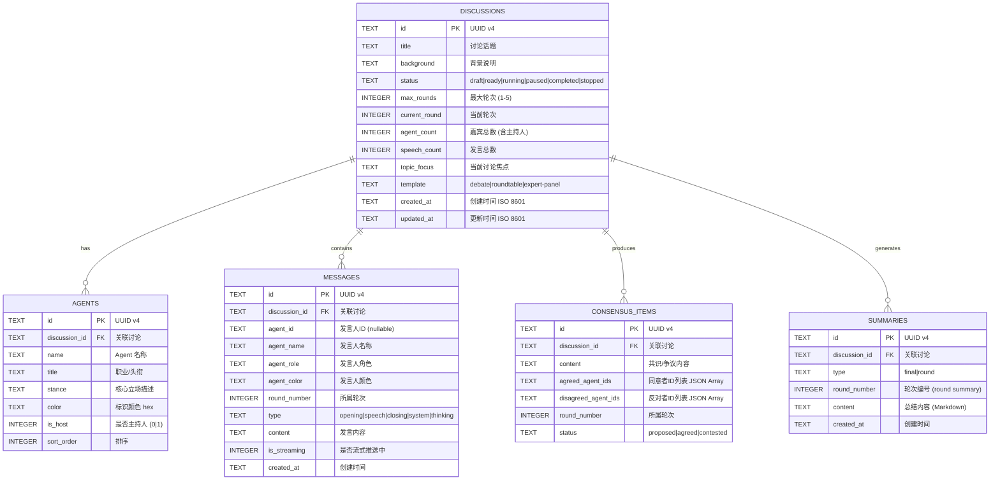

# Entity-Relationship Diagram -- AI Panel Studio

> Database: SQLite (better-sqlite3) | ORM: None (raw SQL)

---

## 1. ER Diagram



---

## 2. Table Design Notes

### 2.1 Discussions

- `status` 枚举对应讨论状态机: `draft → ready → running ⇄ paused → completed / stopped`
- `template` 影响嘉宾生成策略 (辩论模式强调对立、圆桌模式强调多样)
- `agent_count` 包含主持人 (如 1 host + 4 guests = 5)

### 2.2 Agents

- 通过 `discussion_id` 外键关联，CASCADE 删除
- `is_host = 1` 只有一条记录 (主持人)
- `sort_order = -1` 确保主持人排在最前

### 2.3 Messages

- `agent_id` 可为 NULL (系统消息)
- `is_streaming` 标记消息是否还在推送中 (SSE 增量更新)
- `type` 区分消息类型，前端可据此渲染不同样式

### 2.4 Consensus Items

- `agreed_agent_ids` / `disagreed_agent_ids` 以 JSON 数组存储
- `status = 'contested'` 且 `disagreed_agent_ids` 非空 = 存在分歧

### 2.5 Summaries

- `type = 'round'` 为轮次总结，`type = 'final'` 为最终总结
- `content` 以 Markdown 格式存储

---

## 3. Index Strategy

| Index | Purpose |
|-------|---------|
| `idx_agents_discussion` | 按讨论ID快速查询 Agent 列表 |
| `idx_messages_discussion` | 按讨论ID查询 Transcript |
| `idx_consensus_discussion` | 按讨论ID查询共识项 |
| `idx_summaries_discussion` | 按讨论ID查询总结 |

所有索引均建在 `discussion_id` 外键上，因为所有查询都以讨论为维度。

---

## 4. Data Lifecycle

```
[创建讨论] → INSERT discussion + INSERT agents
[启动讨论] → UPDATE discussion.status = 'running'
[发言生成] → INSERT message (is_streaming=1)
            → UPDATE message (is_streaming=0) when complete
[共识提炼] → INSERT consensus_item
[生成总结] → INSERT summary
[讨论结束] → UPDATE discussion.status = 'completed'
[删除讨论] → DELETE discussion (CASCADE 删除所有关联数据)
```
