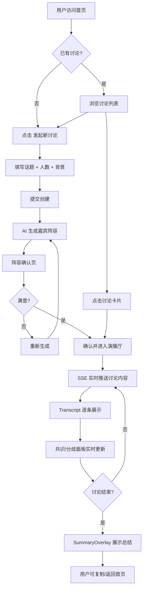
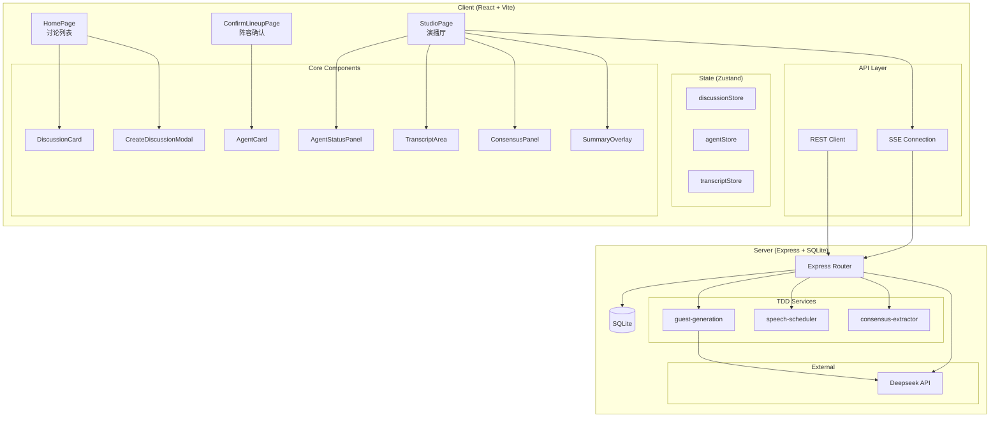

# Product Requirements Document -- AI Panel Studio

> Version: 1.0.0 | Status: MVP Complete | Last Updated: 2026-06-26

---

## 1. Product Overview

### 1.1 Vision

AI Panel Studio 是一个 AI 驱动的圆桌讨论演播厅，用户只需输入话题，系统自动生成由 AI 扮演的专家阵容，进行多轮结构化辩论，并实时提炼共识与分歧，最终输出讨论总结。

### 1.2 Target Users

- **内容创作者**: 为播客/视频提供多角度讨论素材
- **研究者**: 快速探索某个议题的多维观点
- **教育者**: 在课堂上展示多视角思辨过程
- **决策者**: 在决策前快速了解各方论证

### 1.3 Core Value Proposition

> "用 AI 模拟一场高质量的专家圆桌讨论，省去组织真实会议的时间与协调成本。"

---

## 2. User Flow

---

## 3. Functional Architecture

---

## 4. Feature List

### 4.1 MVP Features (All Complete)

| ID | Feature | Priority | Status |
|----|---------|----------|--------|
| F1 | 讨论列表展示（状态筛选、搜索） | P0 | ✅ |
| F2 | 创建新讨论（话题、人数、背景、模板） | P0 | ✅ |
| F3 | AI 自动生成嘉宾阵容（Deepseek API + fallback） | P0 | ✅ |
| F4 | 阵容确认页（重新生成、进入演播厅） | P0 | ✅ |
| F5 | 演播厅实时 Transcript（SSE 流式推送） | P0 | ✅ |
| F6 | 共识/分歧面板（实时提炼） | P0 | ✅ |
| F7 | 讨论总结覆盖层（底部滑入动画） | P0 | ✅ |
| F8 | 多轮讨论引擎（speech-scheduler 调度） | P0 | ✅ |
| F9 | 暂停/恢复/停止讨论控制 | P1 | ✅ |
| F10 | 响应式布局（Desktop / Tablet / Mobile） | P1 | ✅ |
| F11 | 并行讨论隔离（独立 SSE 流） | P1 | ✅ |
| F12 | SSE 断线自动重连 | P1 | ✅ |

### 4.2 Future Features

| ID | Feature | Priority |
|----|---------|----------|
| F13 | 用户账号系统（OAuth 登录） | P2 |
| F14 | 讨论历史持久化（文件/云端存储） | P2 |
| F15 | 多语言支持（i18n） | P2 |
| F16 | 讨论话题推荐引擎 | P3 |
| F17 | 讨论录音/回放功能 | P3 |
| F18 | 分享讨论链接（只读视图） | P3 |
| F19 | 自定义 Agent 模板市场 | P3 |
| F20 | 语音合成（TTS 朗读专家发言） | P4 |

---

## 5. Non-Functional Requirements

| Category | Requirement | Status |
|----------|-------------|--------|
| Performance | 首页加载 < 2s (LCP) | ✅ |
| Performance | SSE 事件延迟 < 500ms | ✅ |
| Reliability | SSE 断线自动重连（指数退避） | ✅ |
| Usability | 响应式三档适配（Desktop/Tablet/Mobile） | ✅ |
| Testability | 单元测试覆盖率 >= 80% | ✅ |
| Testability | E2E 测试覆盖 3 个核心场景 | ✅ |
| Security | CORS 限制前端域名 | ✅ |
| Security | API Key 通过环境变量注入 | ✅ |

---

## 6. Success Metrics

| Metric | Target | Current |
|--------|--------|---------|
| 讨论创建成功率 | > 95% | 100% (fallback 保障) |
| SSE 连接成功率 | > 99% | Tested |
| 单元测试通过率 | 100% | 64/64 ✅ |
| E2E 测试通过率 | 100% | 21 tests designed |
| 前端构建大小 | < 300KB gzip | ~68KB gzip |
