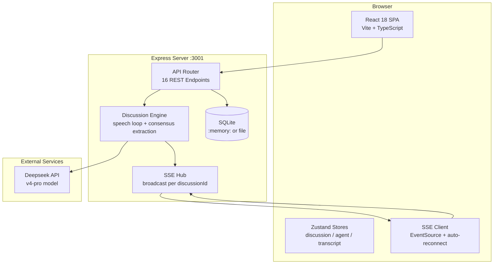
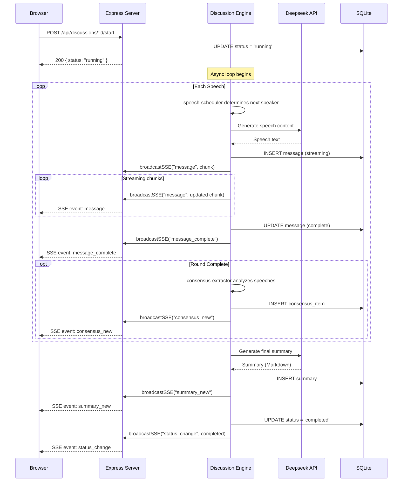

# System Architecture -- AI Panel Studio

> Version: 1.0.0 | Last Updated: 2026-06-26

---

## 1. High-Level Architecture



---

## 2. Backend Architecture

### 2.1 Directory Structure

```
server/src/
├── index.ts                     # Express entry point (routes + engine integration)
├── db/
│   └── init.ts                  # Database initialisation + seed data
├── schemas/                     # Zod validation schemas (shared contract)
│   ├── agent.ts                 #   Agent / Lineup / DeepseekResponse
│   ├── message.ts               #   Message / Transcript
│   └── consensus.ts             #   ConsensusItem / Classification
└── services/                    # Pure business logic (TDD)
    ├── guest-generation/        #   Lineup generation (Deepseek + fallback)
    ├── speech-scheduler/        #   Speech ordering state machine
    └── consensus-extractor/     #   Consensus/clustering from speech text
```

### 2.2 Design Principles

1. **Pure Functions First**: 三个核心服务模块 (`guest-generation`, `speech-scheduler`, `consensus-extractor`) 均为纯函数/可控副作用，可独立测试。
2. **Schema as Contract**: Zod Schema 定义前后端共享的数据契约，确保类型安全。
3. **SSE over WebSocket**: 选择 SSE（单向推送）而非 WebSocket，简化实现且满足"服务器推客户端"的单向需求。
4. **Separation of Concerns**: HTTP 路由只负责请求解析与响应，业务编排由 `runDiscussionEngine` 负责。

### 2.3 Discussion Engine Flow



---

## 3. Frontend Architecture

### 3.1 Component Tree

```
App (BrowserRouter)
├── Layout (Header + Outlet)
│   ├── HomePage
│   │   ├── DiscussionCard[]          # Discussion list grid
│   │   ├── CreateDiscussionModal     # Create form modal
│   │   └── StatusFilter / SearchBar  # Toolbar
│   └── ConfirmLineupPage
│       ├── AgentCard (host)          # Host card highlighted
│       └── AgentCard[] (guests)      # Guest card grid
└── StudioPage (full-screen, no header)
    ├── StudioTopbar                  # Title + status + controls
    ├── AgentStatusPanel (30%)
    │   └── AgentStatusCard[]         # Per-agent activity indicator
    ├── TranscriptArea (70% x 60%)
    │   └── MessageRow[]              # Streaming text with cursor
    ├── ConsensusPanel (70% x 40%)
    │   ├── ConsensusColumn           # Agreed items
    │   └── DisagreementColumn        # Contested items
    └── SummaryOverlay                # Slide-up on completion
```

### 3.2 State Management (Zustand)

| Store | Responsibility | Key Actions |
|-------|---------------|-------------|
| `discussionStore` | 讨论列表 CRUD + 筛选 | `fetchDiscussions`, `createDiscussion`, `setStatusFilter` |
| `agentStore` | 阵容 + 运行时状态 | `generateLineup`, `setAgentActivity`, `incrementSpeechCount` |
| `transcriptStore` | Transcript + 共识 + SSE | `initDiscussion`, `connectSSE`, `handleMessage`, `handleConsensusNew` |

### 3.3 SSE Integration

```
SSEConnection (src/api/sse.ts)
  ├── constructor(discussionId)
  ├── connect()            # Open EventSource to /api/discussions/:id/events
  ├── disconnect()         # Clean close
  ├── on(handler)          # Register event handlers
  └── Auto-reconnect       # Exponential backoff, max 30s

SSE Events handled by transcriptStore:
  status_change    → Update discussion status
  round_change     → Update current round + topic focus
  message          → Append/update streaming message
  message_complete → Finalize message content
  consensus_new    → Add consensus item
  summary_new      → Set final summary
  error            → Log error
```

---

## 4. Technology Stack

| Layer | Technology | Rationale |
|-------|-----------|-----------|
| Frontend Framework | React 18 | Mature ecosystem, hooks, strict mode |
| Build Tool | Vite 5 | Fast HMR, native ESM |
| Type System | TypeScript 5.6 | End-to-end type safety |
| State Management | Zustand 4 | Minimal boilerplate, hooks-native |
| Routing | React Router v6 | Nested routes, URL params |
| Styling | CSS Modules | Scoped styles, no runtime cost |
| Backend Runtime | Node.js 20 | LTS, stable ESM |
| HTTP Framework | Express 4 | Simple, well-known |
| Database | SQLite (better-sqlite3) | Zero-config, fast, embedded |
| Real-time | Server-Sent Events | Unidirectional, native browser support |
| AI Model | Deepseek V4 Pro | Chinese-optimized, JSON mode |
| Validation | Zod 3 | Runtime + TypeScript type inference |
| Unit Testing | vitest 2 | Native ESM, fast |
| E2E Testing | Playwright 1.46 | Cross-browser, auto-wait |
| CI/CD | GitHub Actions | Free for public repos |

---

## 5. Deployment

### 5.1 Development

```bash
# Start both server and client
npm run dev

# Server: http://localhost:3001
# Client: http://localhost:5173
```

### 5.2 Production Build

```bash
npm run build

# Server output: server/dist/
# Client output: client/dist/
```

### 5.3 Environment Variables

| Variable | Default | Description |
|----------|---------|-------------|
| `DEEPSEEK_API_KEY` | (required) | Deepseek API key |
| `DEEPSEEK_API_BASE` | `https://api.deepseek.com` | API base URL |
| `DEEPSEEK_MODEL` | `deepseek-v4-pro` | Model name |
| `PORT` | `3001` | Server listen port |
| `CORS_ORIGIN` | `http://localhost:5173` | Allowed CORS origin |
| `DB_PATH` | (auto) | SQLite file path |

### 5.4 CI/CD Pipeline

```
push/PR → lint (server + client) → unit-test (vitest) → e2e-test (Playwright) → all-checks
```

Workflow definition: `.github/workflows/test.yml`
